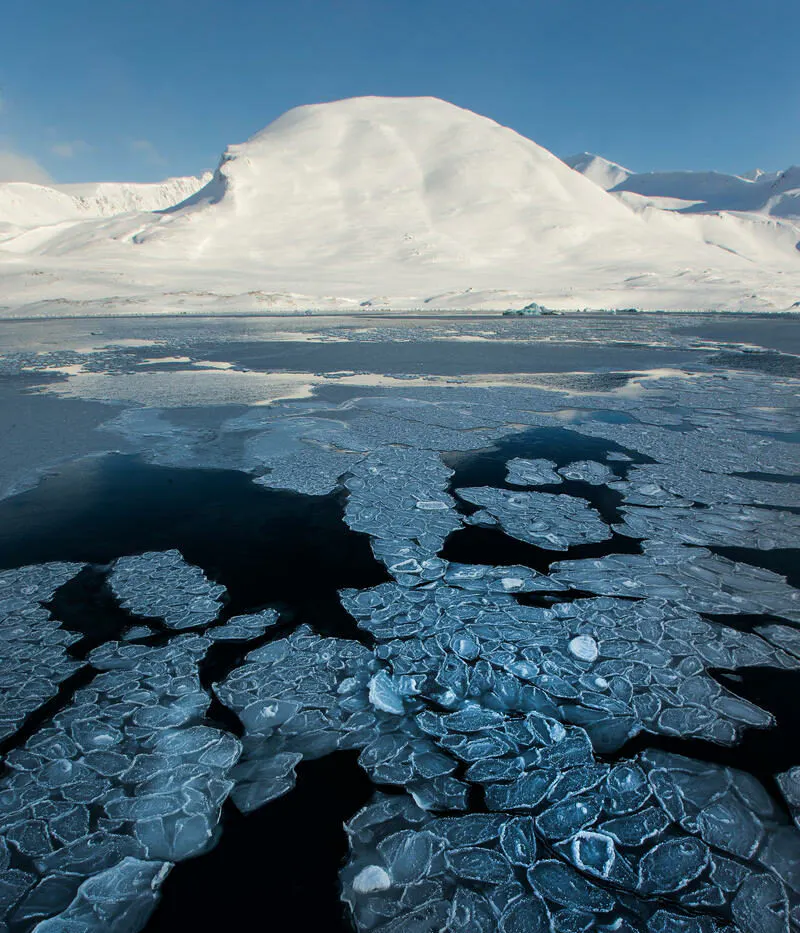
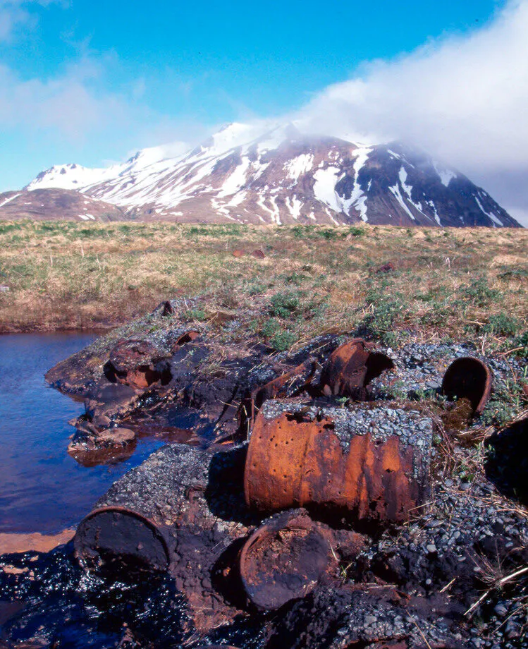
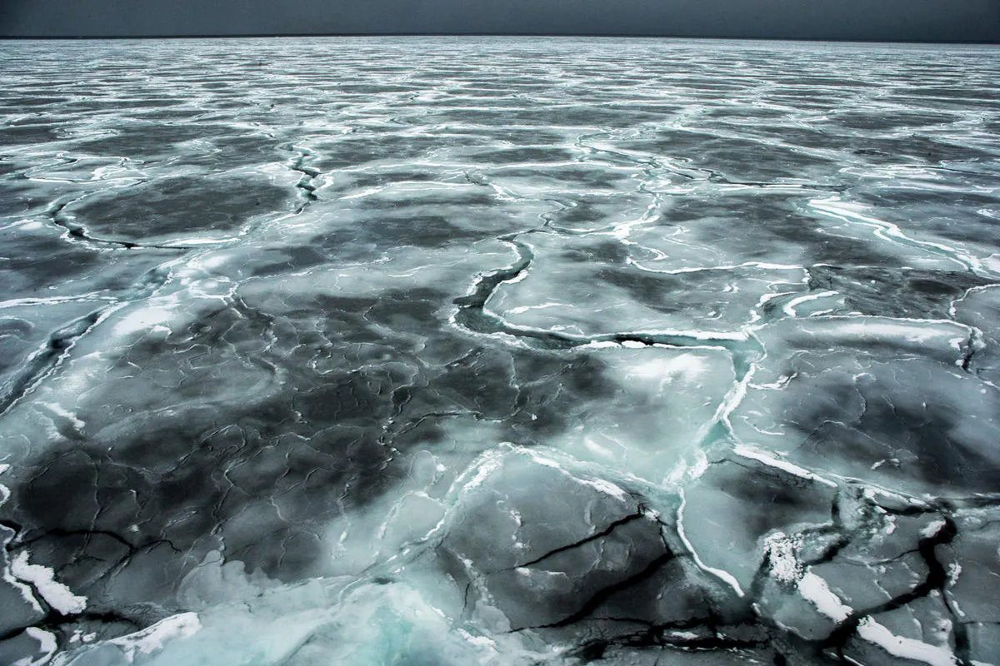

Melting ice caps due to climate change are opening new routes for oil and gas exploration. While the Arctic holds an estimated 22% of the world’s undiscovered oil and gas, exploration in this fragile ecosystem is highly controversial. Countries like Russia, Canada, and the U.S. are expanding their extraction activities, but these efforts face criticism due to the high risks of oil spills in fragile ecosystems and the exacerbation of global warming. This has led to strong opposition from environmental groups.

Information and images taken from [https://www.arcticwwf.org/threats/oil-and-gas/](https://www.arcticwwf.org/threats/oil-and-gas/)