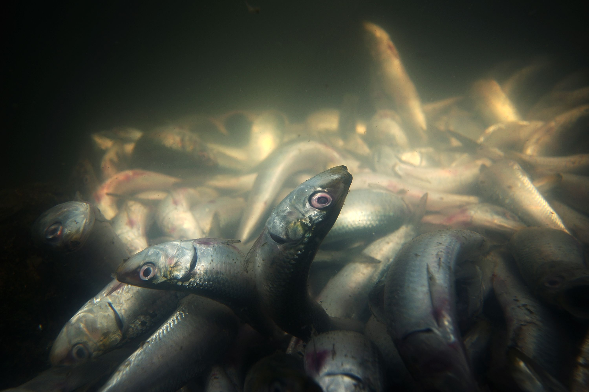
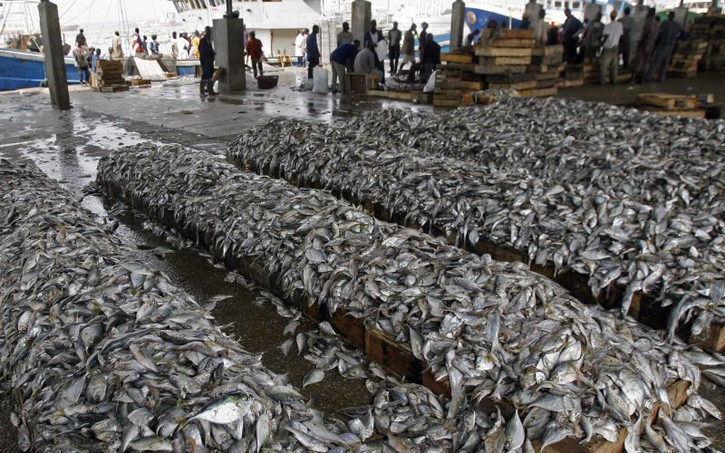
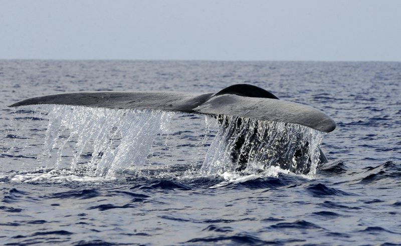

Overfishing has significantly depleted many fish stocks, driving industrial fleets to venture into deeper and more remote waters, such as the high seas and regions around the Pacific and Indian Oceans. These areas have become new fishing frontiers, often leading to disputes over fishing rights. The expansion into these distant waters raises concerns about unsustainable practices that threaten marine biodiversity and compromise the food security of communities reliant on fish.

Illegal, unreported, and unregulated (IUU) fishing compounds these issues, posing a severe global threat to marine ecosystems, economies, and communities. By depleting fish stocks and damaging habitats, IUU fishing undermines efforts to promote sustainable fisheries management, making it a critical concern for preserving ocean health and ensuring equitable resource distribution.

Information taken from [https://www.fisheries.noaa.gov/insight/understanding-illegal-unreported-and-unregulated-fishing](https://www.fisheries.noaa.gov/insight/understanding-illegal-unreported-and-unregulated-fishing)  
Images taken from [https://www.cnn.com/2013/03/22/world/oceans-overfishing-climate-change/index.html](https://www.cnn.com/2013/03/22/world/oceans-overfishing-climate-change/index.html)