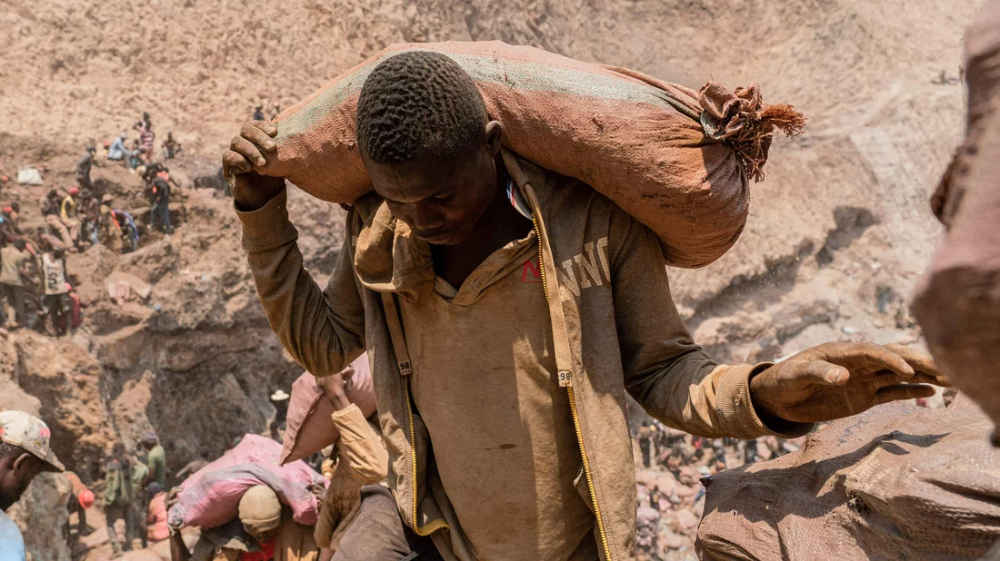
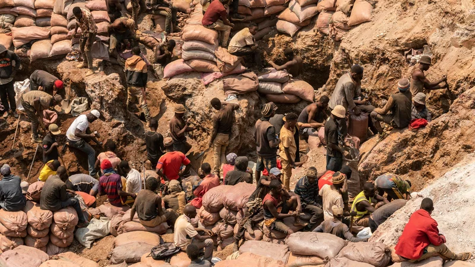
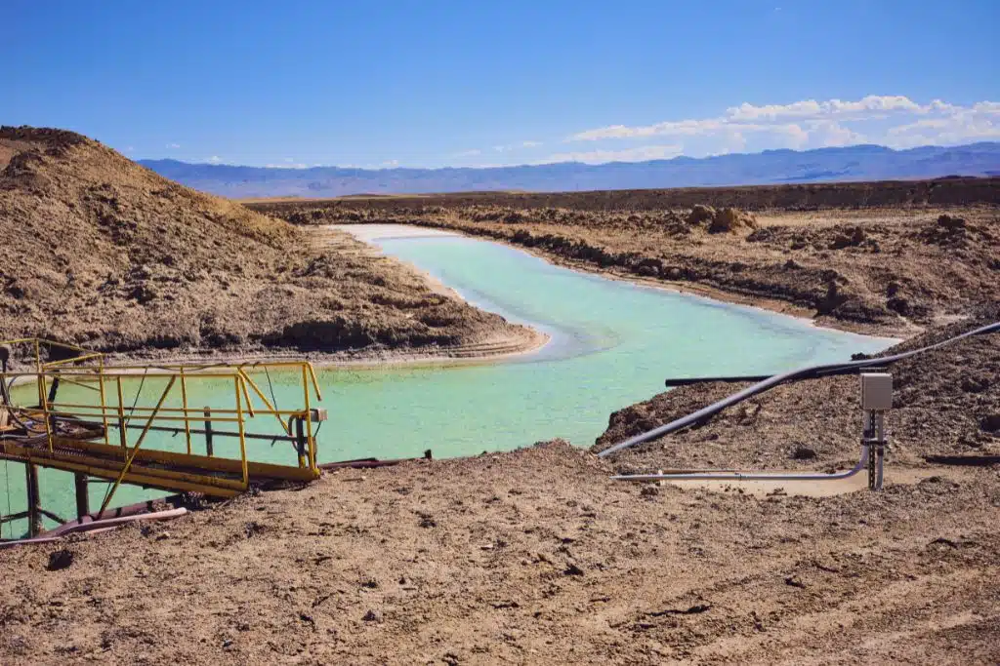

The soaring demand for minerals like lithium and cobalt, crucial for electric vehicle batteries and renewable energy storage, has led to ethical and environmental concerns. In the Democratic Republic of Congo, cobalt mining is linked to hazardous conditions, child labor, and exploitation. Traditional mining regions face scrutiny, while companies explore new sources, such as deep-sea mining and Latin America. Lithium extraction, particularly in regions like Chile and Argentina, raises environmental issues, including water depletion, soil contamination, and habitat destruction in sensitive ecosystems. Efforts for sustainability and corporate accountability are ongoing, but challenges persist in addressing labor abuses and environmental impacts.

Information taken from [https://earth.org/lithium-and-cobalt-mining/](https://earth.org/lithium-and-cobalt-mining/)  
Information and images taken from [https://www.npr.org/sections/goatsandsoda/2023/02/01/1152893248/red-cobalt-congo-drc-mining-siddharth-kara](https://www.npr.org/sections/goatsandsoda/2023/02/01/1152893248/red-cobalt-congo-drc-mining-siddharth-kara)