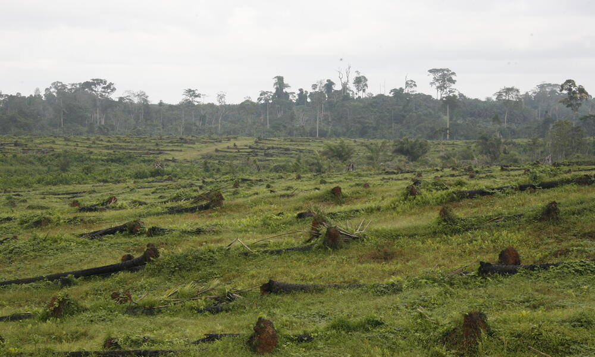
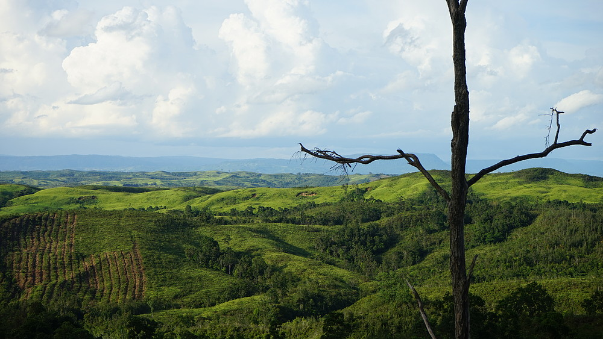

Palm oil production has been a major driver of deforestation, particularly in Southeast Asia. Indonesia and Malaysia are the largest producers, but other tropical regions in Africa and Latin America are seeing increasing plantation developments. This expansion threatens biodiversity, including endangered species like orangutans, and has significant impacts on indigenous communities and local ecosystems. Farming of palm oil also contributes to air pollution, soil and water pollution, soil erosion, and climate change in general.

Images and information taken from [https://wwf.panda.org/discover/our_focus/food_practice/sustainable_production/palm_oil/#](https://wwf.panda.org/discover/our_focus/food_practice/sustainable_production/palm_oil/#)  
Information taken from [https://www.worldwildlife.org/industries/palm-oil](https://www.worldwildlife.org/industries/palm-oil)