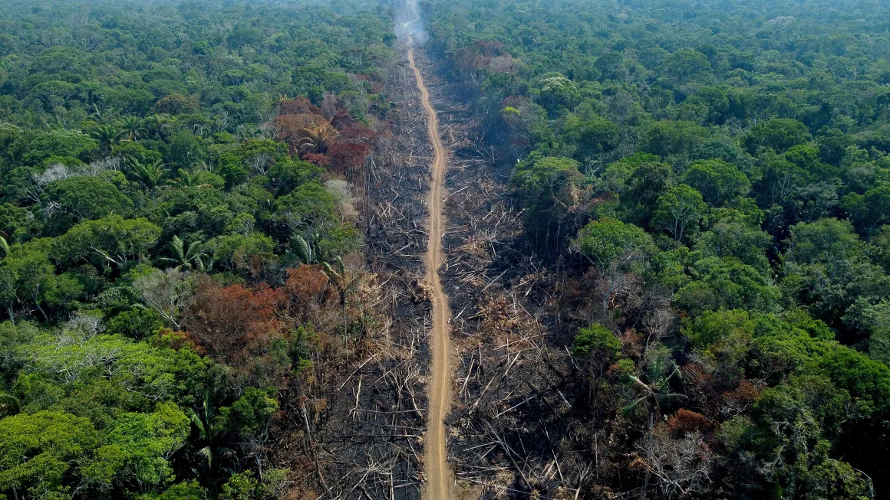
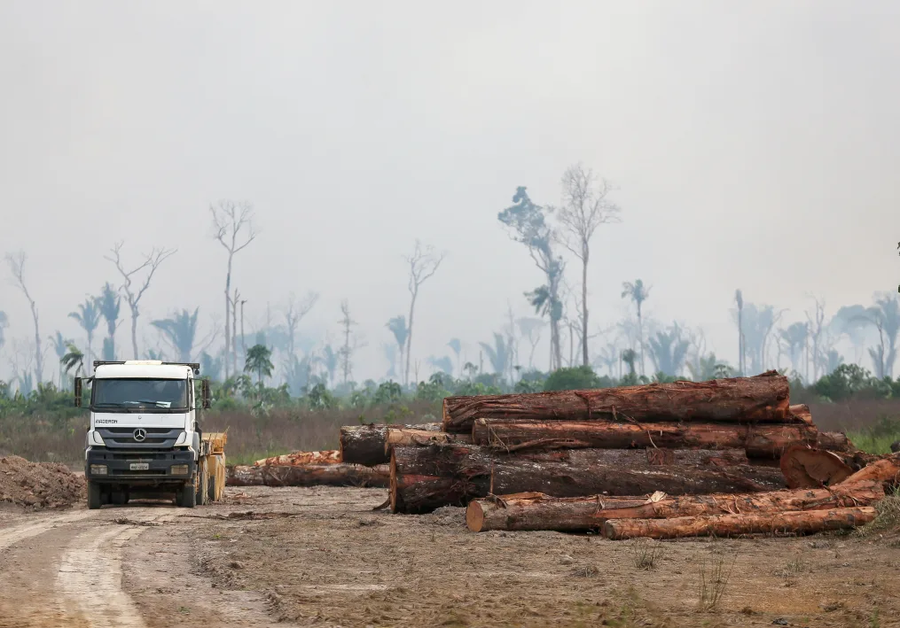
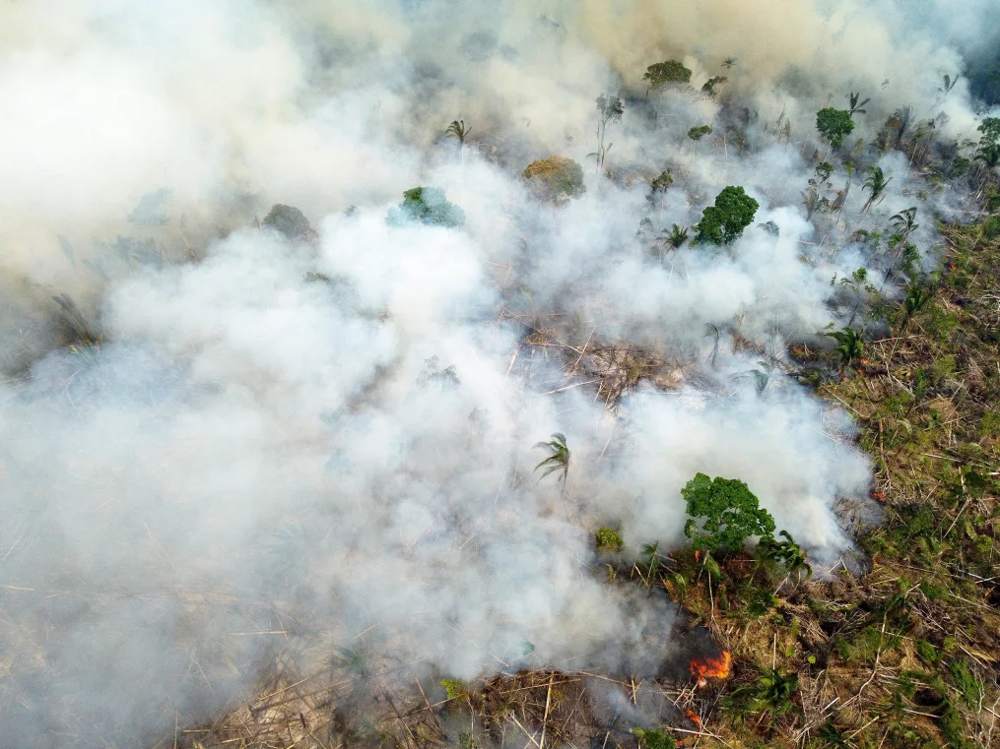
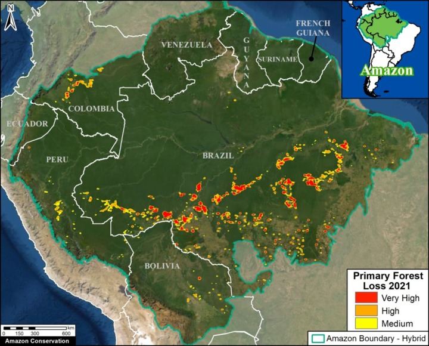

The Amazon has been a critical commodity frontier for timber, soy, and cattle ranching. Expansion of these industries often involves illegal deforestation, exacerbating climate change and leading to loss of biodiversity. The Brazilian government has faced criticism for policies that incentivize land clearing, while international pressures push for more sustainable practices​. Since the 1970s, deforestation has claimed over 185 million acres of forests, and the rate of deforestation is only decreasing. Not only is the Amazon being deforested, parts are also being burned to create grasslands and open fields.

Information taken from [https://www.amazonconservation.org/the-challenge/threats/](https://www.amazonconservation.org/the-challenge/threats/)  
Images taken from [https://www.cnn.com/2022/09/20/americas/brazil-bolsonaro-deforestation-term-intl-latam/index.html](https://www.cnn.com/2022/09/20/americas/brazil-bolsonaro-deforestation-term-intl-latam/index.html)  
Maps taken from [https://www.maaproject.org/amazon-hotspots-2021/](https://www.maaproject.org/amazon-hotspots-2021/)