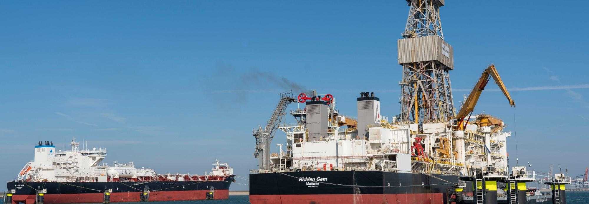
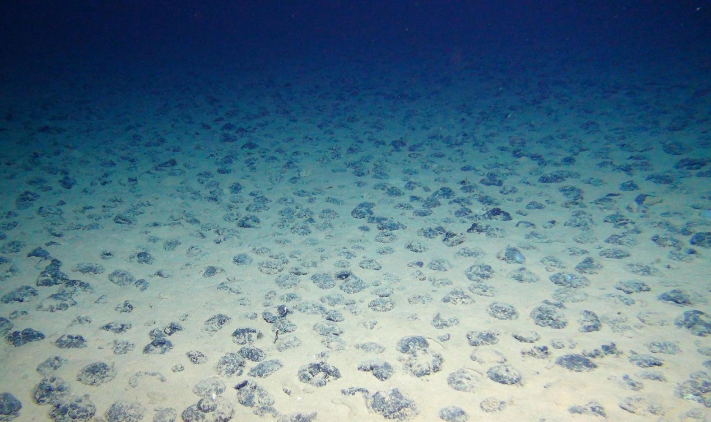
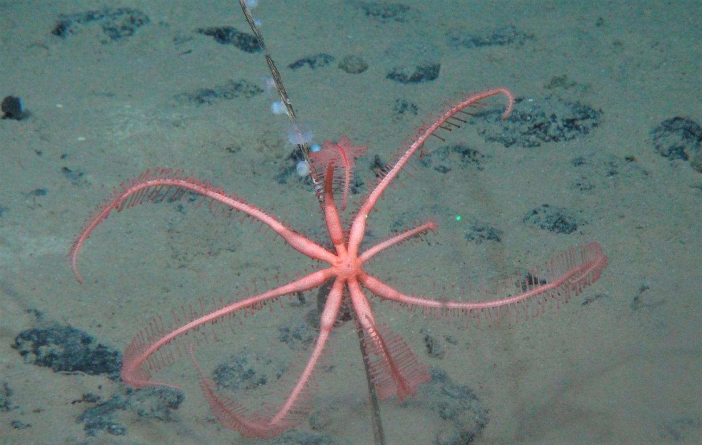

Deep-sea mining is being considered as a new frontier for sourcing metals like cobalt, nickel, and manganese, essential for electronics and green technologies. The focus has been on areas like the Clarion-Clipperton Zone in the Pacific. While proponents argue it could provide a more stable and ethical supply of minerals, the environmental risks are significant, including potential harm to deep-sea ecosystems and biodiversity that are not yet fully understood. Countries like Norway and Nauru are leading exploration efforts, but there is also a growing call for a moratorium until more research can ensure minimal environmental impact

Information and images taken from [https://www.wri.org/insights/deep-sea-mining-explained](https://www.wri.org/insights/deep-sea-mining-explained)